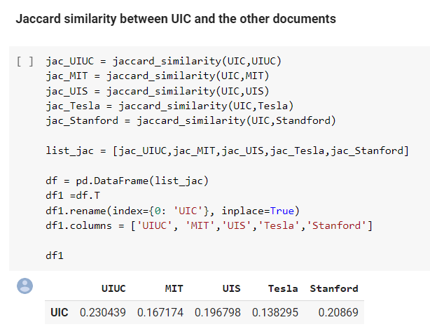
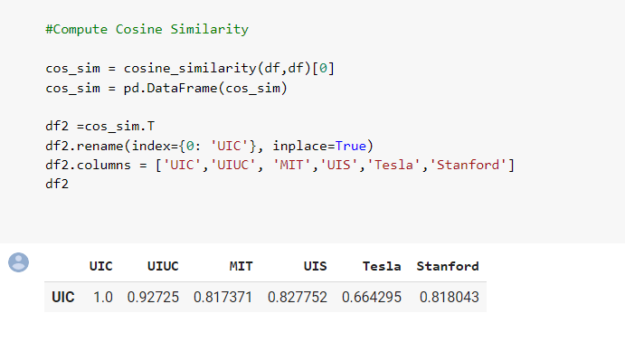

# Document-Similarity-Identifier

### Table of contents
* [Introduction](#introduction)
* [Problem Statement](#problem-statement)
* [Data Source](#data-source)
* [Technologies](#technologies)
* [Type of Data](#type-of-data)
* [Data Pre-processing](#data-pre-processing)
* [Algorithms Implemented](#algorithms-implemented)
* [Steps Involved](#steps-involved)
* [Results and Conclusion](#results-and-conclusion)

### Introduction

With the explosion of data daily, finding out similarity between documents is become very important nowadays. So, in this program we have created a document similarity function which finds out how similar are documents. And the best part about the function is it can be used to calculate similarity between multiple documents at the same time.

### Objective :

Calculate Jaccard similarity and cosine similarity between the documents 'UIC' with 'UIUC', 'MIT','UIS','Tesla', and 'Stanford' text documents.

### INPUT FILES :

The wikipedia documents of the below file names are taken as the input files to compare for the program - 

* Stanford
* Tesla
* UIC
* UIS
* UIUC

### Data Source

Wikipedia

### Technologies
* Python 

### Type of Data
* Text files

### Data Pre-processing
* Tokenizing, removal of stop words and stemming was done for textual data

### Algorithms Implemented
* Jaccard Similarity Function
* Cosine  Similarity Function

### Steps Involved

* Cleaned the data by tokenizing, removal of stop words and stemming.
* Applied Jaccard Similarity on the tokenized words in each file
* Applied Cosine  Similarity on the tokenized words in each file

### Results and Conclusion

Finally, below are the results of similarity between UIC and rest of the documents - 

* Jaccard Similarity

* Cosine Similarity

